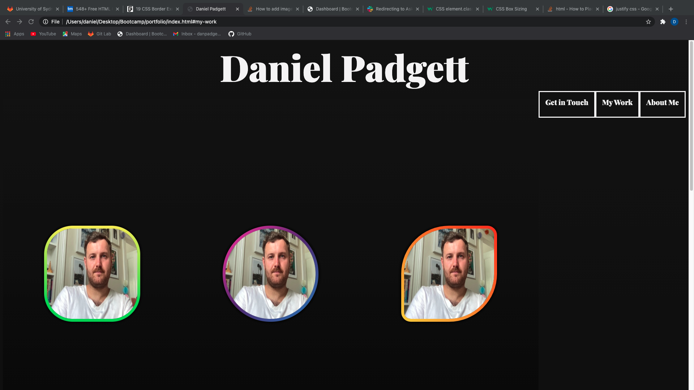
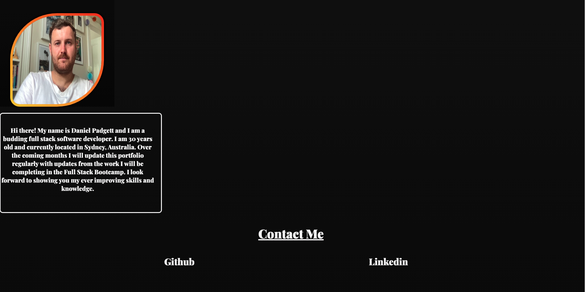
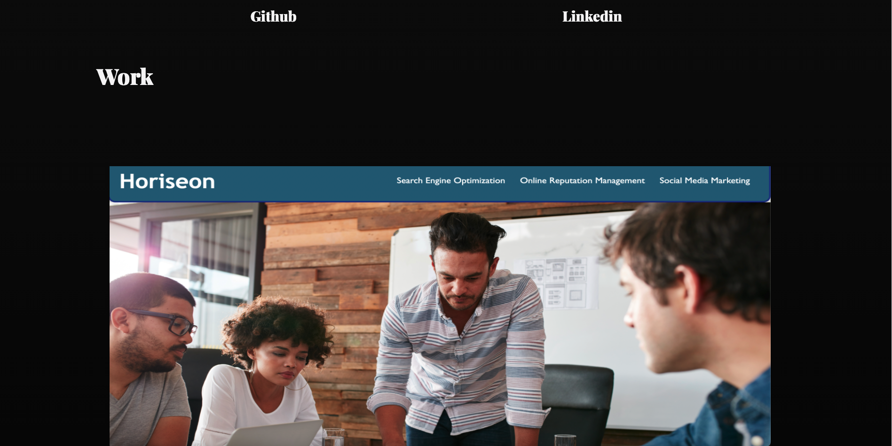

# portfolio

The Homework for the second week of the coding bootcamp was to create a portfolio page using html and advanced css methods.

Both the CSS and HTML files have been commented to highlight what has been created.

The 3 screenshots below show the work that was done the first time i attempted to create my portfolio page, the layout was basic, imcomplete and provided an example of the inexperience I had in terms of developing.

Weeks later the portfolio while having the same basic look as the first attempt has been improved significantly through new techniques such as bootstrap and also the addition of icons to create a crisper looking portfolio page.

This is the deployed URL.

https://danpadge16.github.io/portfolio/

